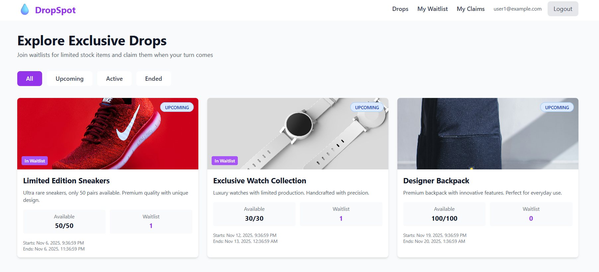
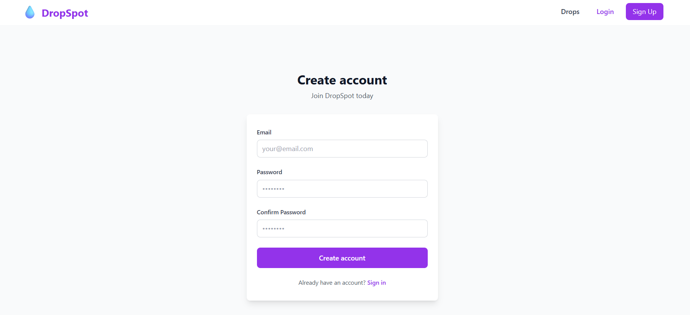
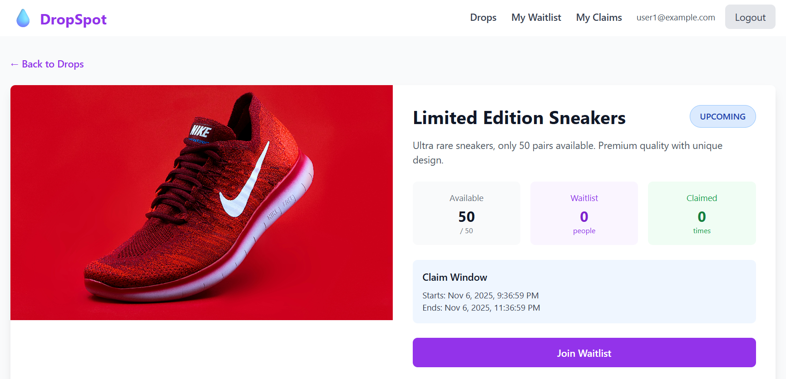
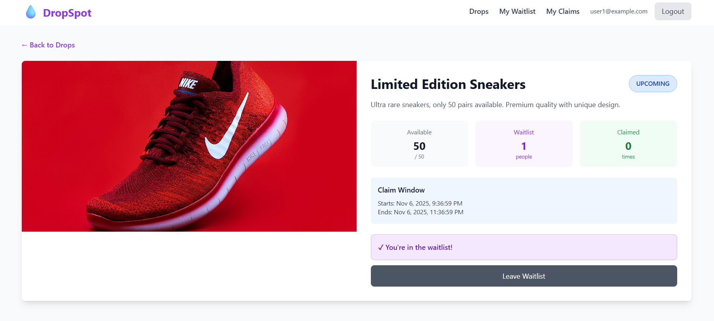
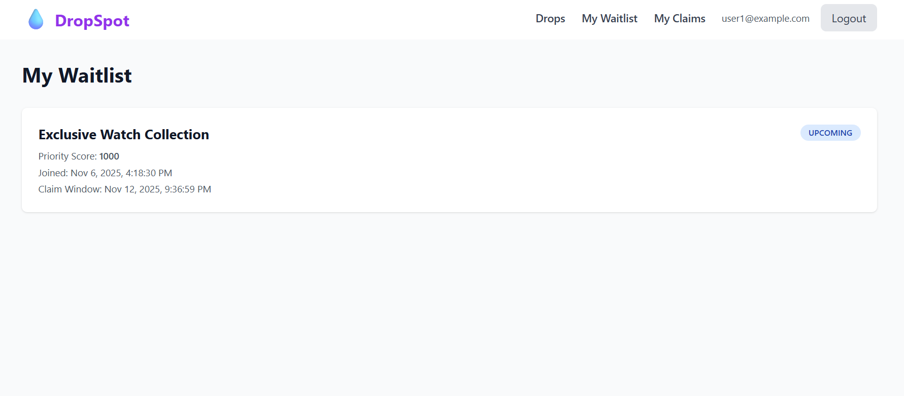
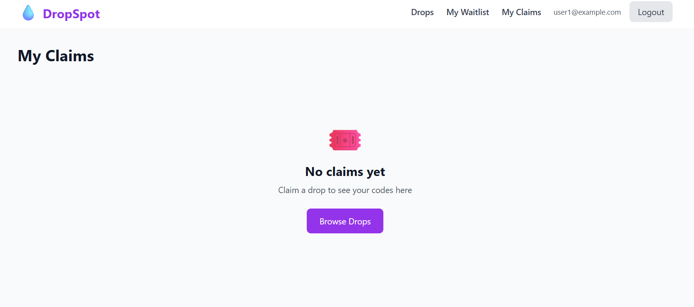
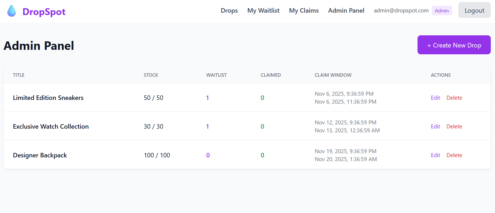
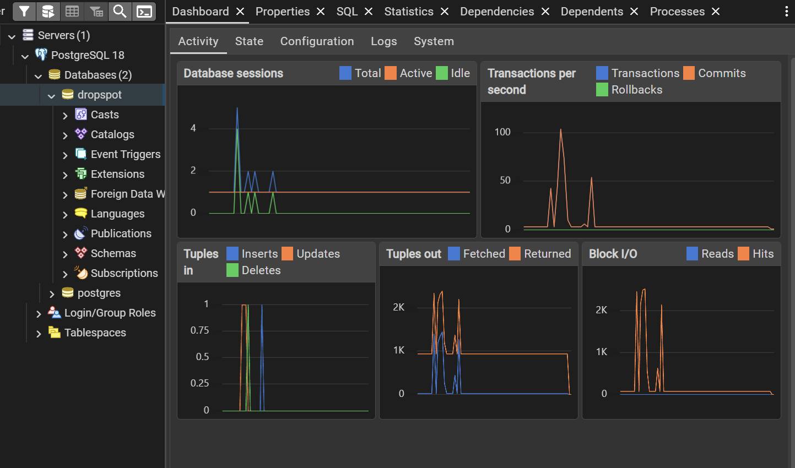

# DropSpot - Limited Stock & Waitlist Platform

**Project Start Date:** November 6, 2024

A full-stack application for managing limited stock product drops with waitlist functionality and fair claim distribution based on priority scoring.

## 📋 Table of Contents

- [Project Overview](#project-overview)
- [Architecture](#architecture)
- [Data Model](#data-model)
- [API Endpoints](#api-endpoints)
- [CRUD Module](#crud-module)
- [Idempotency & Transaction Handling](#idempotency--transaction-handling)
- [Installation](#installation)
- [Seed Generation](#seed-generation)
- [Technical Decisions](#technical-decisions)
- [Screenshots](#screenshots)
- [Testing](#testing)

## 🎯 Project Overview

DropSpot is a platform where users can:
- Browse limited stock drops
- Join/leave waitlists for upcoming drops
- Claim products during claim windows based on priority
- Admin users can manage drops through CRUD operations

### Key Features

- **Priority-based waitlist**: Fair distribution using seed-based scoring
- **Idempotent operations**: Safe duplicate requests
- **Transaction integrity**: ACID compliance for critical operations
- **Role-based access**: User and Admin roles
- **Real-time stock management**: Automatic inventory updates

## 🏗️ Architecture

### Backend Architecture
```
Node.js + Express + PostgreSQL

├── Authentication Layer (JWT)
├── Authorization Middleware (Admin/User)
├── Controllers (Business Logic)
├── Models (Data Access)
├── Services (Priority Calculation)
└── Database (PostgreSQL with Transactions)
```

### Frontend Architecture
```
React 18 + Vite + Tailwind CSS

├── Context API (Auth State)
├── React Router (Navigation)
├── Axios (API Client)
├── Toast Notifications
└── Responsive UI Components
```

### Technology Stack

**Backend:**
- Node.js 18+
- Express.js
- PostgreSQL
- JWT for authentication
- bcryptjs for password hashing
- Jest & Supertest for testing

**Frontend:**
- React 18
- Vite (Build tool)
- Tailwind CSS
- React Router v6
- Axios
- date-fns
- React Toastify

## 📊 Data Model

### Database Schema
```sql
-- Users Table
users (
  id SERIAL PRIMARY KEY,
  email VARCHAR(255) UNIQUE NOT NULL,
  password VARCHAR(255) NOT NULL,
  role VARCHAR(50) DEFAULT 'user',
  account_age_days INTEGER DEFAULT 0,
  created_at TIMESTAMP DEFAULT CURRENT_TIMESTAMP
)

-- Drops Table
drops (
  id SERIAL PRIMARY KEY,
  title VARCHAR(255) NOT NULL,
  description TEXT,
  image_url VARCHAR(500),
  total_stock INTEGER NOT NULL,
  available_stock INTEGER NOT NULL,
  claim_window_start TIMESTAMP NOT NULL,
  claim_window_end TIMESTAMP NOT NULL,
  status VARCHAR(50) DEFAULT 'upcoming',
  created_at TIMESTAMP DEFAULT CURRENT_TIMESTAMP
)

-- Waitlist Table
waitlist (
  id SERIAL PRIMARY KEY,
  user_id INTEGER REFERENCES users(id),
  drop_id INTEGER REFERENCES drops(id),
  priority_score INTEGER DEFAULT 0,
  signup_latency_ms INTEGER DEFAULT 0,
  rapid_actions INTEGER DEFAULT 0,
  joined_at TIMESTAMP DEFAULT CURRENT_TIMESTAMP,
  UNIQUE(user_id, drop_id)
)

-- Claims Table
claims (
  id SERIAL PRIMARY KEY,
  user_id INTEGER REFERENCES users(id),
  drop_id INTEGER REFERENCES drops(id),
  claim_code VARCHAR(255) UNIQUE NOT NULL,
  claimed_at TIMESTAMP DEFAULT CURRENT_TIMESTAMP,
  UNIQUE(user_id, drop_id)
)
```

## 🔌 API Endpoints

### Authentication
```
POST   /api/auth/signup          - Register new user
POST   /api/auth/login           - User login
GET    /api/auth/me              - Get current user (Protected)
```

### Drops
```
GET    /api/drops                - Get all drops
GET    /api/drops/:id            - Get drop details
POST   /api/drops/:id/join       - Join waitlist (Protected)
POST   /api/drops/:id/leave      - Leave waitlist (Protected)
POST   /api/drops/:id/claim      - Claim drop (Protected)
GET    /api/drops/user/waitlist  - Get user waitlist (Protected)
GET    /api/drops/user/claims    - Get user claims (Protected)
```

### Admin
```
GET    /api/admin/drops          - Get all drops (Admin)
POST   /api/admin/drops          - Create drop (Admin)
PUT    /api/admin/drops/:id      - Update drop (Admin)
DELETE /api/admin/drops/:id      - Delete drop (Admin)
```

## 🛠️ CRUD Module

The Admin CRUD module allows administrators to manage drops:

### Features
- **Create**: Add new drops with validation
- **Read**: View all drops with statistics
- **Update**: Modify drop details
- **Delete**: Remove drops (cascades to waitlist/claims)

### Authorization
- Only users with `role='admin'` can access
- JWT token required in Authorization header
- 403 Forbidden for non-admin users

## 🔒 Idempotency & Transaction Handling

### Idempotent Operations

All critical operations are idempotent:

**Join Waitlist:**
```javascript
// Multiple calls return same result
if (existingEntry) {
  return { success: true, alreadyJoined: true };
}
```

**Claim Drop:**
```javascript
// Prevents double claiming
if (existingClaim) {
  return { success: true, alreadyClaimed: true };
}
```

### Transaction Guarantees

1. **Atomicity**: All operations succeed or fail together
2. **Consistency**: Database constraints maintained
3. **Isolation**: FOR UPDATE locks prevent race conditions
4. **Durability**: Committed transactions persist

## 🚀 Installation

### Prerequisites
- Node.js 18+
- PostgreSQL 14+
- npm

### Backend Setup
```bash
cd backend

# Install dependencies
npm install

# Setup environment
cp .env.example .env
# Edit .env with your database credentials

# Run migrations
npm run migrate

# Seed database
npm run seed

# Generate project seed
node src/utils/seedGenerator.js
# Add generated seed to .env

# Start server
npm run dev
```

### Frontend Setup
```bash
cd frontend

# Install dependencies
npm install

# Setup environment
cp .env.example .env

# Start development server
npm run dev
```

### Demo Credentials

**Admin:**
- Email: admin@dropspot.com
- Password: admin123

**User:**
- Email: user1@example.com
- Password: user123

## 🌱 Seed Generation

### Methodology

The project uses a unique seed for priority score calculation:
```javascript
// Seed Generation
raw_data = `${git_remote_url}|${first_commit_timestamp}|${start_datetime}`
seed = SHA256(raw_data).substring(0, 12)
```

### Coefficient Generation
```javascript
A = 7  + (parseInt(seed[0:2], 16) % 5)   // Range: 7-11
B = 13 + (parseInt(seed[2:4], 16) % 7)   // Range: 13-19
C = 3  + (parseInt(seed[4:6], 16) % 3)   // Range: 3-5
```

### Priority Score Formula
```javascript
priority_score = 1000 + 
                 (signup_latency_ms % A) + 
                 (account_age_days % B) - 
                 (rapid_actions % C)
```

## 💡 Technical Decisions

### Why Node.js?
- Non-blocking I/O for high concurrency
- Rich ecosystem
- Same language as frontend

### Why PostgreSQL?
- ACID transactions required
- Strong data integrity
- FOR UPDATE locks for race conditions

### Why React?
- Component-based architecture
- Large ecosystem
- Excellent developer experience with Vite

### Why Tailwind CSS?
- Rapid UI development
- Consistent design system
- Small production bundle

## 📸 Screenshots

### 1. Home Page (Logged Out)

*Browse all available drops without authentication. Shows drop cards with status badges, stock availability, and waitlist counts.*

### 2. Home Page (Logged In)

*Authenticated view showing user status (In Waitlist, Claimed) on drop cards. Navigation includes My Waitlist and My Claims links.*

### 3. Sign Up Page

*User registration form with email and password validation. Clean and simple authentication flow.*

### 4. Drop Detail & Join Waitlist

*Detailed drop view with join waitlist button. Shows available stock, waitlist count, claimed count, and claim window information.*

### 5. Drop Detail - Waitlist Claimed

*User successfully claimed a drop. Shows unique claim code that can be copied. Displays priority score and claim timestamp.*

### 6. My Waitlist Page

*User's personal waitlist showing all joined drops with priority scores, join timestamps, and claim window information.*

### 7. My Claims Page

*User's claimed drops with unique claim codes. Copy to clipboard functionality for easy code sharing.*

### 8. Admin Panel - CRUD Operations

*Admin dashboard for managing drops. Create, edit, and delete drops. View waitlist and claim statistics. Real-time data updates.*

### 9. Database Schema (Bonus)

*PostgreSQL database schema showing relationships between users, drops, waitlist, and claims tables. Demonstrates normalized data structure and foreign key constraints.*

## 🧪 Testing

### Backend Tests
```bash
cd backend
npm test
```

**Unit Tests:**
- Seed generation and coefficient calculation
- Priority score computation

**Integration Tests:**
- Auth endpoints (signup, login)
- Drop endpoints (list, join, leave, claim)
- Admin CRUD operations
- Idempotency verification

### Test Coverage
- Lines: >70%
- Functions: >70%
- Branches: >60%

## 📝 License

This project was created as a case study for Alpaco Full Stack Developer position.

---

**Built with ❤️ for Alpaco**
